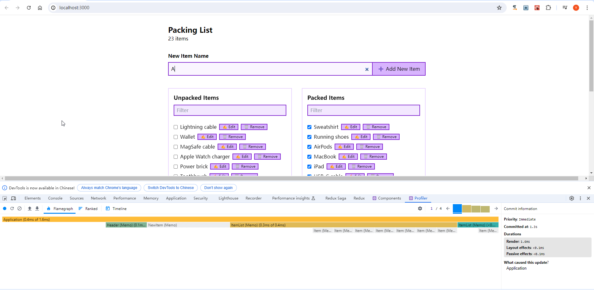
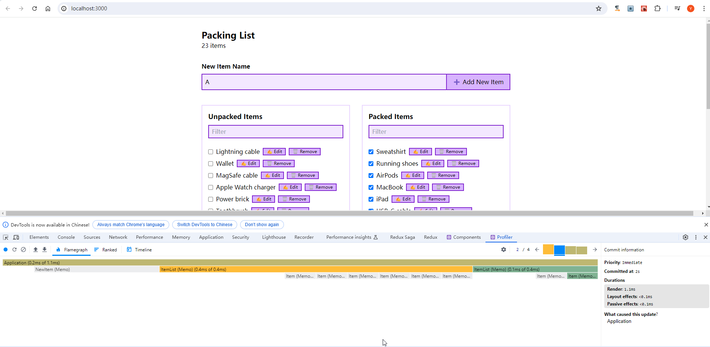
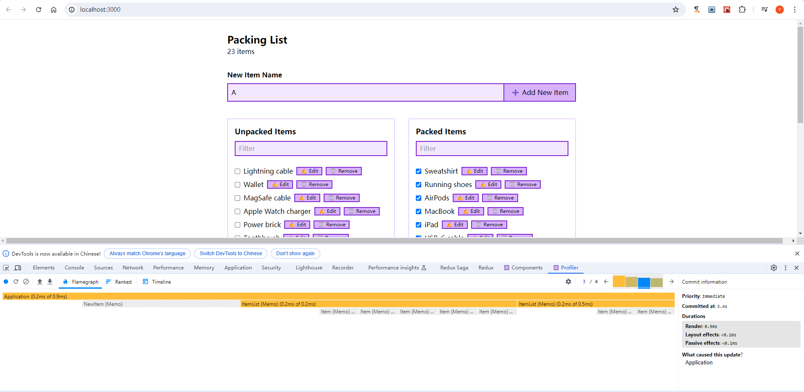

配套视频 [React 性能优化最佳实践](https://www.bilibili.com/video/BV1Qx4y1L71X/?p=15&spm_id_from=333.1007.top_right_bar_window_history.content.click&vd_source=4aeb91e6098d55d8db9eee128a258e1b)

这个分支(p15) 验证了第15节上半节，用usereducer & dispatch 优化性能。

效果如下图，profiler记录了几次点击左侧checkbox操作的结果，透明的部分表示未进行更新的组件。
可以看到很多操作没有触发更新。

#问题
- addItem操作会报错