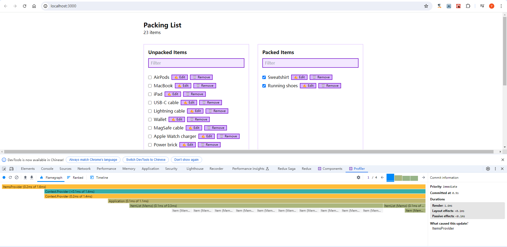

配套视频 [React 性能优化最佳实践](https://www.bilibili.com/video/BV1Qx4y1L71X/?p=15&spm_id_from=333.1007.top_right_bar_window_history.content.click&vd_source=4aeb91e6098d55d8db9eee128a258e1b)

这个分支(p18) 使用multiple context提升性能!

使用ActionsContext和ItemsContext可以将数据和逻辑分离，避免重复渲染。

结果如图，火焰图的最顶层都是透明的，说明没有重复渲染。

