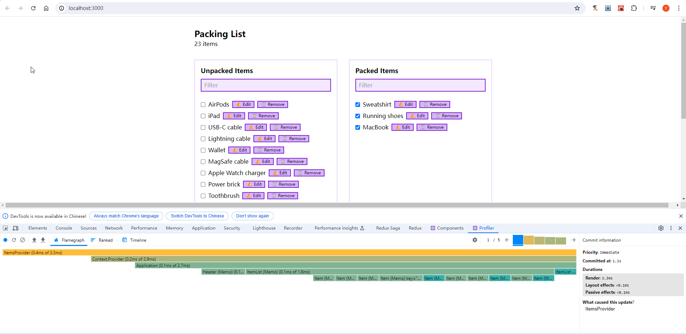

配套视频 [React 性能优化最佳实践](https://www.bilibili.com/video/BV1Qx4y1L71X/?p=15&spm_id_from=333.1007.top_right_bar_window_history.content.click&vd_source=4aeb91e6098d55d8db9eee128a258e1b)

这个分支(p17) 验证了第17节contextapi的使用

当前使用的是1个context,性能比较糟糕，profiler都是彩色的，很多组件都在渲染。

第18节将会使用multiple context，提升性能。